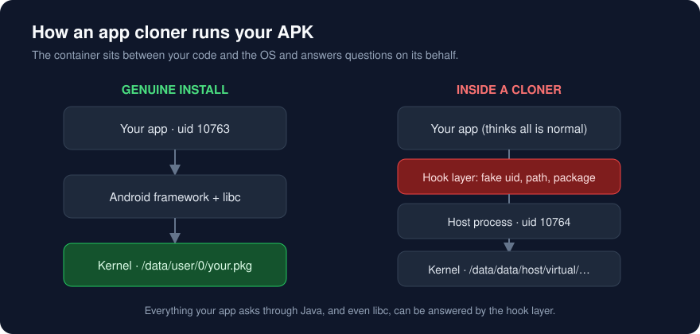
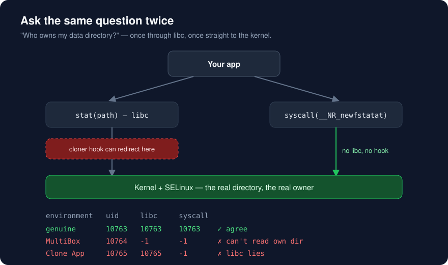
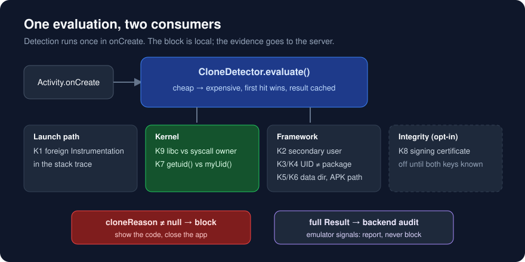

# Catching Android App Cloners by Asking the Kernel

[](https://www.npmjs.com/package/react-native-clone-guard) [](LICENSE)

*How we stopped "one phone, two identities" in a workforce attendance app, and why the usual checks weren't enough.*



## The problem

We run an internal Android app that employees use to clock in and out. The rule behind it is simple: **one device belongs to one employee.** The server binds a device to whoever registers it first, and only that person can check in from it.

Then we found out how cheap it was to get around. Install an app cloner such as MultiBox, Parallel Space or Clone App from the Play Store, clone our app, and the phone now has two copies. Each copy looks like a different device, so one person can check in for a colleague who never showed up.

App cloners aren't malware. They exist so people can run two WhatsApp accounts. The way they work, though, breaks any security rule that depends on the device.

## How a cloner works

A cloner doesn't install a second copy of your APK. It loads your APK **inside its own process**, a virtual container, and puts a hook layer between your code and the operating system. Whenever your app asks something ("what's my package name?", "where is my data directory?", "what's my UID?"), the hook answers with the value a normal install would get.

As far as your code can tell, it's running normally.

## What we measured

Most "detect a cloned app" advice online checks the package name, the data path or the UID from Java. So before writing any rules, we put three environments side by side on one real phone (Samsung Galaxy A53):

| | Genuine install | MultiBox | Clone App |
|---|---|---|---|
| `Process.myUid()` matches package | ✓ | ✓ *(spoofed)* | ✓ *(spoofed)* |
| `applicationInfo.dataDir` looks normal | ✓ | ✓ *(spoofed)* | ✓ *(spoofed)* |
| Process name | ✓ | ✓ *(spoofed)* | ✓ *(spoofed)* |
| libc `stat()` on data dir | ✓ | ✗ | ✓ *(redirected)* |

The whole Java layer was faked, and so was the C library. MultiBox had even hooked `stat()` in libc so it pointed at the container's own directory.

That rules out any check that only asks through Java, and any native check that only goes through libc.

## Asking the same question twice

The hook layer lives **inside the process**, in userspace, where it can patch Java methods and libc symbols. It can't touch the kernel.

So we ask one question, *"who owns my data directory?"*, two different ways:

1. **Through libc**, with `stat()`. The cloner can intercept this.
2. **Straight to the kernel**, with `syscall(__NR_newfstatat, …)`. This skips libc, so no hook sees it.



```c
// Hookable: goes through the libc symbol
stat(path, &info);

// Not hookable from userspace: goes straight to the kernel
syscall(__NR_newfstatat, AT_FDCWD, path, &info, 0);
```

The results were clear:

```
environment   uid     libc     syscall
genuine       10763   10763    10763    ✓ both agree
MultiBox      10764   -1       -1       ✗ can't read its own directory
Clone App     10765   10765    -1       ✗ libc answers, the kernel refuses
```

In a clone, the syscall goes to the **real** directory at `/data/user/0/<our.package>`. SELinux denies access because the cloned process runs under the host app's UID and doesn't own that directory. A genuine install owns its directory and can read it both ways.

That gives three rules:

- **The kernel reports a different owner.** We aren't the process we claim to be.
- **libc answers but the kernel refuses.** libc is being redirected.
- **Neither can read it.** A genuine app always owns its data directory. The one real exception is an app moved to adoptable storage (`/mnt/expand/…`), and we exclude that case.

The general idea is to compare two sources instead of trusting one. A spoofer then has to fake both layers consistently, and one of those layers is out of its reach.

## Layered checks

Relying on one check is fragile, so detection runs as layers from cheapest to most expensive. The first one that fires wins, and each has a short reason code:

| Code | Signal | Why a clone trips it |
|---|---|---|
| **K1** | Stack trace at `onCreate` | The container launches your Activity through its own `Instrumentation`, which puts a foreign class between `Activity` and `ActivityThread`. |
| **K9** | Data dir owner: libc vs syscall | Explained above. |
| **K7** | `getuid()` (native) vs `Process.myUid()` | If they differ, the Java method is hooked. |
| **K2** | `uid / 100000 != 0` | Dual App, Second Space or a work profile runs as a secondary user. |
| **K3 / K4** | `applicationInfo.uid`, `getPackagesForUid()` | In a container, the UID belongs to the host app. |
| **K5** | `applicationInfo.dataDir` pattern | The data lives under the host's directory. |
| **K6** | `/proc/self/maps` | A genuine install maps `base.apk` from `/data/app/…`; a clone maps it from somewhere else. |
| **K8** | Signing certificate SHA-256 | A repackaged APK is signed with the cloner's key. |

On our test phone, MultiBox tripped K4 and K9. **Clone App tripped only K9.** Without the kernel check it would have passed.

## Architecture



Most of the effort went into making these checks safe to ship:

**One source of truth.** `CloneDetector.evaluate()` runs once in `onCreate` and caches the result. The blocking dialog and the attendance request read the same `Result`, so the UI and the server always agree about the device.

**Block locally, audit on the server.** A detected clone gets a dialog with the reason code, and the app closes. The reason code and emulator signals go with every attendance request so the backend keeps evidence, and `Result` also carries the raw libc and syscall values if you want more detail. When someone says "the app won't open", the code in the dialog shows support which layer fired.

**Emulator signals never block.** `Build.HARDWARE == "ranchu"`, `test-keys` and similar values are reported and never enforced. Our own team tests on emulators, and on a rooted device these values are trivial to fake, so they're only useful for spotting casual misuse, not for proving it.

**Fail open.** If the native library doesn't load, the Java fallbacks run instead of crashing. Before trusting K9, we check that raw syscalls work at all by running `stat` on `/system`. If they don't, K9 is skipped instead of blocking every user on that device.

**Signature check: easy to get wrong.** K8 ships disabled. With Play App Signing, Google re-signs your APK, so the certificate on the user's phone is **Google's app signing key, not your upload key.** Hard-code only the upload key hash and you block every employee who installed from the Play Store. Turn it on only after you've listed both hashes:

```kotlin
CloneDetector.evaluate(
    context = this,
    frames = Throwable().stackTrace.map { it.className },
    acceptedSignatures = setOf(
        "<upload key SHA-256>",        // sideloaded / internal builds
        "<Play app signing SHA-256>"   // Play Console → App integrity
    )
)
```

## Limits

No client-side check is absolute. With root, a hooking framework and enough time, all of this can be faked, the kernel view included. The goal is to make cheating cost more than it's worth: move it from "install a free app from the Play Store" to "root your phone and write a custom hook", and leave a trail on the server either way.

The same reasoning led to a second fix. The device identifier used to be a random UUID in app storage, so clearing app data or reinstalling produced a "new" device. It now comes from `ANDROID_ID` on Android and from a Keychain-cached `identifierForVendor` on iOS, with backups disabled so the identity doesn't follow a restore onto another phone.

## Install

**React Native / Expo:** [`react-native-clone-guard`](packages/react-native) on npm

```sh
npx expo install react-native-clone-guard
```

```json
{ "expo": { "plugins": [["react-native-clone-guard", { "block": true }]] } }
```

It hooks into the main activity through Expo's lifecycle listeners, so detection runs before any JavaScript loads. Works in bare React Native after `npx install-expo-modules`.

**Native Android:** copy the `clone-guard/` module (details below).

## Using this code

The `clone-guard/` directory is a small Android library module: one C file, two Kotlin files and no dependencies.

```kotlin
override fun onCreate(savedInstanceState: Bundle?) {
    val result = CloneDetector.evaluate(this, Throwable().stackTrace.map { it.className })
    super.onCreate(savedInstanceState)

    result.cloneReason?.let { reason ->
        // block, and show `reason` so support can tell which layer fired
    }
}
```

See [`sample/MainActivity.kt`](sample/MainActivity.kt) for a complete example. Before enforcing anything, **measure on real hardware first**: log `CloneDetector.lastResult` from genuine installs across your device fleet, confirm it comes back clean, and only then turn on blocking.

```
clone-guard/
├── src/main/cpp/clone_guard.c        # getuid, stat() vs raw syscall
└── src/main/java/dev/clonedetection/guard/
    ├── NativeProbe.kt                # JNI bridge, fails open
    └── CloneDetector.kt              # K1–K9, emulator signals, Result
```

## Summary

- A cloner answers any question your app asks through userspace. Check against the kernel.
- Comparing two sources is stronger than trusting one, because a spoofer has to fake both layers consistently.
- Measure every rule on real devices, and keep blocking separate from auditing. A wrong block costs more than a missed clone.

---

MIT licensed. Issues and measurements from other devices and cloners are welcome.
